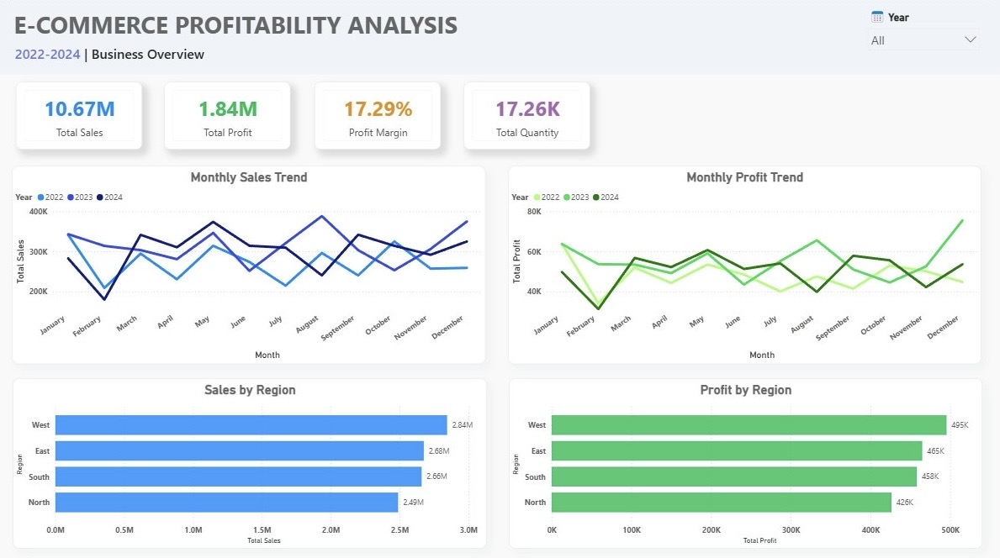
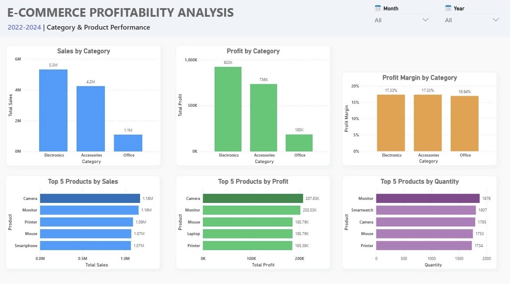
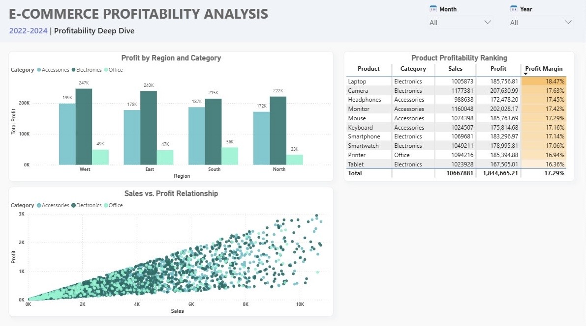

# E-Commerce Profitability Analysis Dashboard (PowerBI)
---
An interactive Power BI dashboard that evaluates business performance, identifies key sales and profit drivers, and supports data-driven business decisions using e-commerce transaction data from **2022–2024**.  The dataset contains over 3,500 orders across key product categories including Electronics, Accessories, and Office Supplies, covering four major regions: North, East, South, and West. 

## Project Objective
This project was developed to:
- Evaluate overall business performance using key business metrics.
- Identify the products and categories driving sales and profit.
- Compare performance across products, categories, and regions.
- Analyze the relationship between sales and profitability.
- Deliver business insights to support data-driven business decisions.

## Business Questions
This dashboard addresses the following business questions:
- How did business performance change between 2022 and 2024?
- Which products and categories contributed the most to sales and profit?
- Was higher profitability driven by higher sales volume or stronger profit margins?
- How did business performance vary across different regions?
- What opportunities can improve future business performance?
---
# Dashboard
## Business Overview

### Key Insights
- The business generated **$10.67M** in total sales and **$1.84M** in total profit, resulting in an overall **17.29% profit margin**.
- Sales and profit followed similar monthly trends, indicating that higher sales generally translated into higher profit.
- The West consistently outperformed other regions across sales, quantity sold, and profit, while the North recorded the weakest overall performance.
- Profit margins remained relatively consistent across all regions, suggesting that regional performance differences were driven primarily by sales volume rather than margin efficiency.

## Category & Product Performance

### Key Insights
- Electronics was the strongest-performing category, generating the highest sales and profit throughout the analysis period.
- Higher profit was primarily driven by **sales volume rather than stronger profit margins**. Although Electronics generated substantially more profit than Accessories, both categories maintained nearly identical profit margins, indicating that stronger financial performance was mainly driven by higher sales volume.
- Office products contributed the smallest share of total sales and profit while maintaining a profit margin comparable to other categories, suggesting that lower performance was primarily driven by lower demand.
- Top-performing products varied across sales, profit, and quantity sold, indicating that different products contributed to business performance in different ways.

## Profitability Deep Dive

### Key Insights
- Sales and profit showed a strong positive relationship across individual transactions. However, transactions with similar sales values sometimes generated different profit levels, indicating that sales alone do not fully explain profitability.
- Electronics remained the largest profit contributor in every region, demonstrating consistently strong performance across different geographic markets.
- Products with comparable sales achieved different profit margins, suggesting that pricing and cost efficiency also influence profitability.
- Year-level analysis showed that the top-performing products by profit margin were not consistent across the analysis period, indicating that product profitability changed over time.
---
## Business Recommendations

Based on the analysis, the following recommendations could help improve business performance:
- Focus on profitable growth by prioritizing products that consistently generate strong profit while maintaining healthy profit margins, rather than relying solely on higher sales volume.
- Increase the sales contribution of lower-performing categories, particularly Office Products, while maintaining their existing profit margin performance.
- Evaluate product performance using sales, profit, quantity sold, and profit margin together, as different products excelled under different business metrics.
- Review product profitability regularly, as year-level analysis showed that the highest-margin products were not consistent throughout the analysis period.

## Dataset
- **Source:** [Kaggle](https://www.kaggle.com/datasets/mmumairkhattak/e-commerce-orders-dataset-2026-scra?select=ecommerce_orders_notebook.ipynb)
- **Domain:** E-Commerce Sales
- **Analysis Period:** 2022–2024
- **Records:** ~3,500 transactions
